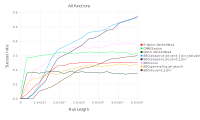
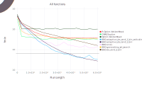
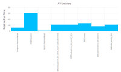

# BlackBoxOptimizationBenchmarking.jl

[](https://travis-ci.org/jonathanBieler/BlackBoxOptimizationBenchmarking.jl)

A Julia implementation of the [Black-Box-Optimization-Benchmarking](http://coco.gforge.inria.fr) (BBOB) functions.

### Benchmark results







### Functions

Functions can be accessed as `BlackBoxOptimizationBenchmarking.F1`, which returns a `BBOBFunction` with fields `f` containing the function itself, `f_opt` its minimal value, and `x_opt` its minimizer, i.e. `f(x_opt) = f_opt`.

Functions can be listed using `enumerate`:

```julia
julia> enumerate(BBOBFunction)
20-element Array{BlackBoxOptimizationBenchmarking.BBOBFunction,1}:
 Sphere                                           
 Ellipsoidal Function                             
 Discus Function                                  
 Bent Cigar Function                              
 Sharp Ridge Function                             
 Different Powers Function                        
 Rastrigin Function                               
 Weierstrass Function                             
 Schaffers F7 Function                            
 Schaffers F7 Function, moderately ill-conditioned
 Composite Griewank-Rosenbrock Function F8F2      
 Ellipsoidal                                      
 Schwefel Function                                
 Rastrigin                                        
 Buche-Rastrigin                                  
 Linear Slope                                     
 Attractive Sector                                
 Step Ellipsoidal Function                        
 Rosenbrock Function, original                    
 Rosenbrock Function, rotated
 ```
 
A benchmark for a single optimizer and function can be run with:

```julia
benchmark(optimizer::Any, f::BBOBFunction, run_lengths, Ntrials, dimensions, Δf)
```

Or for a collection of optimizers with:

```julia
benchmark(optimizers::Vector{T}, funcs, run_lengths, Ntrials, dimensions, Δf)
```

See [test/runtests.jl](test/runtests.jl)         

The optimizer must implement the methods `optimize`, `minimum` and `minimizer`, see

[scripts/optimizers_interface.jl](scripts/optimizers_interface.jl)

### Reference:

http://coco.lri.fr/downloads/download15.01/bbobdocfunctions.pdf
