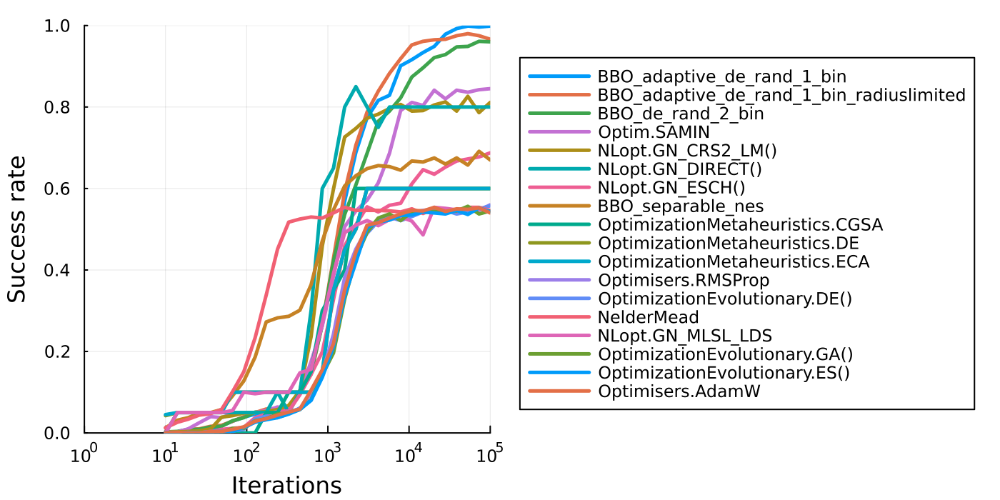
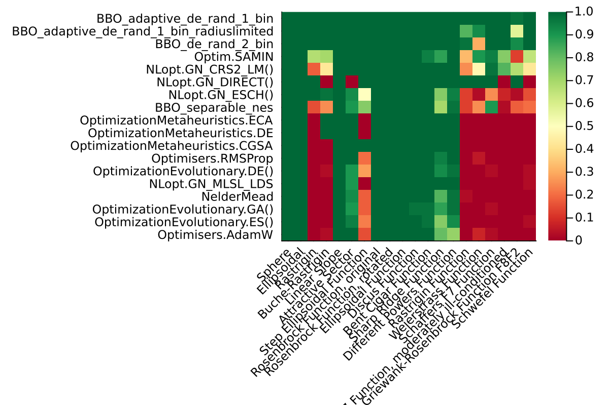
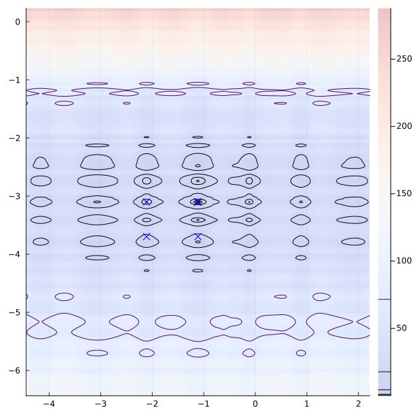

# BlackBoxOptimizationBenchmarking.jl

[](https://github.com/jonathanBieler/BlackBoxOptimizationBenchmarking.jl/actions/workflows/CI.yml)

A Julia implementation of the [Black-Box-Optimization-Benchmarking](http://coco.gforge.inria.fr) (BBOB) functions.

### Benchmark results

The average sucess rate (meaning the optimizer reached the minimum + 1e-6) in function of the number of iterations, in 3 dimension : 



BlackBoxOptim's algorithm are performing the best in 3D.

Since some global optimizers have poor final convergence, they were chained into a Nelder-Mead using 10% of the objective function evaluation budget.
Note that some algorithm call the objective function several time per iteration, so this plot is not totally fair (it doesn't really impact the results however).

If we look at the sucess rate per function we can see that only a few algorithm are able to solve all the problems :



The script to produce these plots is in `scripts/run_benchmark.jl`.

### Functions

Functions with input dimension `N` can be generated using `bbob_suite`. Generate
the suite once and index it by the BBOB function number:

```julia
julia> using BlackBoxOptimizationBenchmarking

julia> suite = bbob_suite(Val(2));

julia> suite[1]
F1  Sphere

julia> suite
20-element Vector{BBOBFunction}:
 F1  Sphere
 F2  Ellipsoidal
 F3  Rastrigin
 F4  Buche-Rastrigin
 F5  Linear Slope
 F6  Attractive Sector
 F7  Step Ellipsoidal
 F8  Rosenbrock
 F9  Rosenbrock Rotated
 F10 Ellipsoidal 2
 F11 Discus
 F12 Bent Cigar
 F13 Sharp Ridge
 F14 Different Powers
 F15 Rastrigin 2
 F16 Weierstrass
 F17 Schaffers F7
 F18 Schaffers F7 Ill-Cond
 F19 Griewank-Rosenbrock
 F20 Schwefel
 ```

The index is the function number, so `suite[3]` is F3 (Rastrigin), for example.
An individual `BBOBFunction` `f` has fields `f_opt`, its minimum value, and `x_opt`, its minimizer, i.e. `f(f.x_opt) == f.f_opt`.

#### Migrating from v1

In v1, functions were accessed from a global collection and accepted inputs of different dimensions. In v2, each function contains dimension-specific static vectors and rotation matrices. Create a suite for the required dimension and replace global lookups as follows:

```julia
# v1
f = BlackBoxOptimizationBenchmarking.BBOBFunctions[3]

# v2
suite = BlackBoxOptimizationBenchmarking.bbob_suite(Val(5))
f = suite[3]
```

Keep `suite` and reuse it rather than regenerating it for every function call. The optional seed selects a reproducible BBOB instance:

```julia
suite = bbob_suite(Val(5); seed = 123)
```

Changing the dimension requires generating another suite. This dimension-specific API is what allows the functions to use static arrays and run on GPUs.

Functions can be plot using :

```julia
using Plots
plot(f::BBOBFunction; nlevels = 15, zoom=1)
```

### Benchmarks

A benchmark for a single optimizer and function can be run with:

```julia
b::BenchmarkResults = benchmark(
    optimizer, f::BBOBFunction, run_length::AbstractVector{Int}; 
    Ntrials::Int = 20, dimension::Int = 3, Δf::Real = 1e-6, CI_quantile=0.25
)
```

The first argument `optimizer` must implement [Optimization.jl](https://docs.sciml.ai/Optimization/stable/)'s interface, and
it must be wrapped in a `BenchmarkSetup` to indicate if the optimizer requires bounds :

`BenchmarkSetup(optimizer, isboxed = true)`

To test an optimizer on several functions a vector of `BBOBFunction`'s can be passed instead of a single function, 
and all the returned statistics will be averaged over functions (with the expection of `success_rate_per_function`).

The main fields of the returned struct `BenchmarkResults` are : 

- `run_length` : number of iterations the optimizer performed
- `callcount` : number of objective function calls
- `success_rate` : for each run_length, the fraction of optimization runs that reached the global minimum with a tolerance of Δf

A benchmark can be plot with :

```julia
using Plots

plot(b; label = "NelderMead", x = :callcount, showribbon = true)
plot!(another_benchmark)
```

The ribbon indicates the 25% to 95% confidence intervals of the `success_rate` (the quantile used
can be changed with `compute_CI!(b::BenchmarkResults, CI_quantile)`).

We can test an algorithm on a function and plot the result using

```julia
Δf = 1e-6
f = test_functions[3]

setup = BenchmarkSetup(NLopt.GN_CRS2_LM(), isboxed=true)

sol = [BBOB.solve_problem(setup, f, 3, 5_000) for in in 1:10]
@info [sol.objective < Δf + f.f_opt for sol in sol]

p = plot(f, size = (600,600), zoom = 1.5)
for sol in sol
    scatter!(sol.u[1:1], sol.u[2:2], label="", c="blue", marker = :xcross, markersize=5, markerstrokewidth=0)
end
p
```



### Generating new instance of the functions

To avoid overfiting and test if algorithms are robust with respect to translation and rotations of
the error function, rotation matrices and local minima are randomly generated when calling `bbob_suite` (controlled by the `seed` parameters, see docstrings).

### Reference:

https://numbbo.github.io/gforge/downloads/download16.00/bbobdocfunctions.pdf
