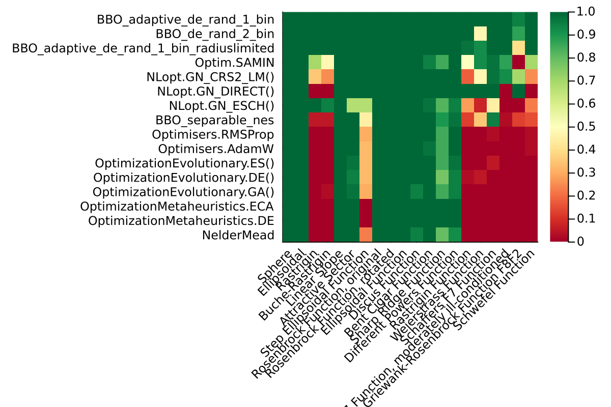
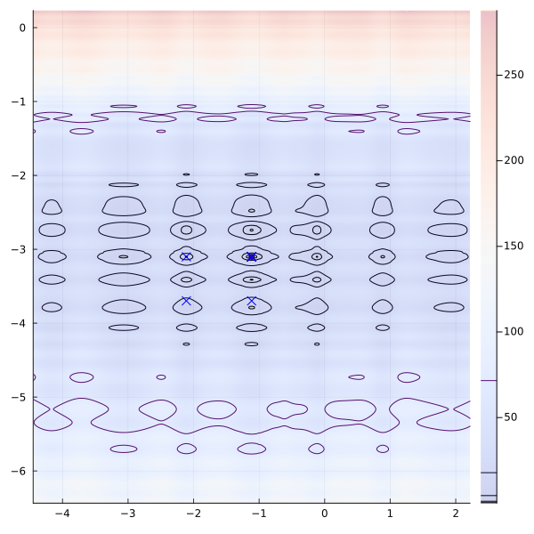

# BlackBoxOptimizationBenchmarking.jl

[](https://github.com/jonathanBieler/BlackBoxOptimizationBenchmarking.jl/actions/workflows/CI.yml)

A Julia implementation of the [Black-Box-Optimization-Benchmarking](http://coco.gforge.inria.fr) (BBOB) functions.

### Benchmark results

The average sucess rate (meaning the optimizer reached the minimum + 1e-6) in function of the number of iterations, in 3 dimension : 


BlackBoxOptim's algorithm are performing the best in 3D.

Since some global optimizers have poor final convergence, they were chained into a Nelder-Mead using 10% of the objective function evaluation budget.
Note that some algorithm call the objective function several time per iteration, so this plot is not totally fair (it doesn't really impact the results however).

If we look at the sucess rate per function we can see that only a few algorithm are able to solve all the problems :



The script to produce these plots is in `scripts/run_benchmark.jl`.

### Functions

Indivdual functions can be accessed as `BlackBoxOptimizationBenchmarking.F1`, which returns a `BBOBFunction` with fields `f` containing the function itself, `f_opt` its minimal value, and `x_opt` its minimizer, i.e. `f(x_opt) = f_opt`.

Functions can be listed using `list_functions()`:

```julia
julia> BlackBoxOptimizationBenchmarking.list_functions()
20-element Array{BlackBoxOptimizationBenchmarking.BBOBFunction,1}:
 Sphere                                           
 Ellipsoidal Function                             
 Discus Function                                  
 Bent Cigar Function                              
 Sharp Ridge Function                             
 Different Powers Function                        
 Rastrigin Function                               
 Weierstrass Function                             
 Schaffers F7 Function                            
 Schaffers F7 Function, moderately ill-conditioned
 Composite Griewank-Rosenbrock Function F8F2      
 Ellipsoidal                                      
 Schwefel Function                                
 Rastrigin                                        
 Buche-Rastrigin                                  
 Linear Slope                                     
 Attractive Sector                                
 Step Ellipsoidal Function                        
 Rosenbrock Function, original                    
 Rosenbrock Function, rotated
 ```
 
Functions can be plot using :

```julia
using Plots
plot(f::BBOBFunction; nlevels = 15, zoom=1)
```

### Benchmarks

A benchmark for a single optimizer and function can be run with:

```julia
b::BenchmarkResults = benchmark(
    optimizer, f::BBOBFunction, run_length::AbstractVector{Int}; 
    Ntrials::Int = 20, dimension::Int = 3, Δf::Real = 1e-6, CI_quantile=0.25
)
```

The first argument `optimizer` must implement [Optimization.jl](https://docs.sciml.ai/Optimization/stable/)'s interface, and
it must be wrapped in a `BenchmarkSetup` to indicate if the optimizer requires bounds :

`BenchmarkSetup(optimizer, isboxed = true)`

To test an optimizer on several functions a vector of `BBOBFunction`'s can be passed instead of a single function, 
and all the returned statistics will be averaged over functions (with the expection of `success_rate_per_function`).

The main fields of the returned struct `BenchmarkResults` are : 

- `run_length` : number of iterations the optimizer performed
- `callcount` : number of objective function calls
- `success_rate` : for each run_length, the fraction of optimization runs that reached the global minimum with a tolerance of Δf

A benchmark can be plot with :

```julia
using Plots

plot(b; label = "NelderMead", x = :callcount, showribbon = true)
plot!(another_benchmark)
```

The ribbon indicates the 25% to 95% confidence intervals of the `success_rate` (the quantile used
can be changed with `compute_CI!(b::BenchmarkResults, CI_quantile)`).

We can test an algorithm on a function and plot the result using

```julia
Δf = 1e-6
f = test_functions[3]

setup = BenchmarkSetup(NLopt.GN_CRS2_LM(), isboxed=true)

sol = [BBOB.solve_problem(setup, f, 3, 5_000) for in in 1:10]
@info [sol.objective < Δf + f.f_opt for sol in sol]

p = plot(f, size = (600,600), zoom = 1.5)
for sol in sol
    scatter!(sol.u[1:1], sol.u[2:2], label="", c="blue", marker = :xcross, markersize=5, markerstrokewidth=0)
end
p
```



### Generating new instance of the functions

To avoid overfiting and test if algorithms are robust with respect to rotations of
the error function, rotation matrices are randomly generated the first time the package is used.

If needed new rotations can be generated by running the following:

```julia
@eval BlackBoxOptimizationBenchmarking begin
    @memoize function Q(D)
        r = randn(D); r = r/norm(r)
        Q = [r nullspace(Matrix(r'))]
    end
    @memoize function R(D)
        r = randn(D); r = r/norm(r)
        R = [r nullspace(Matrix(r'))]
    end
end
```

### Reference:

https://numbbo.github.io/gforge/downloads/download16.00/bbobdocfunctions.pdf
